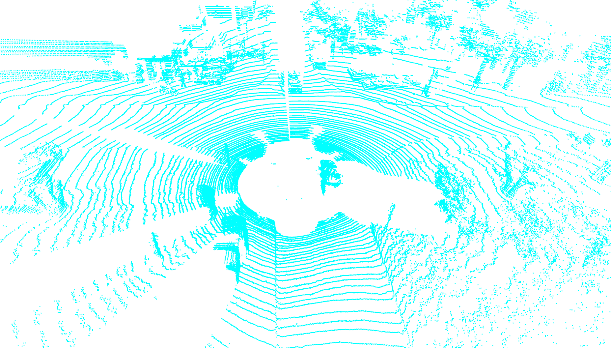
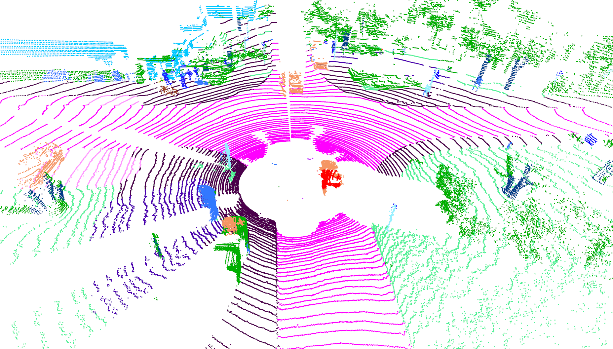
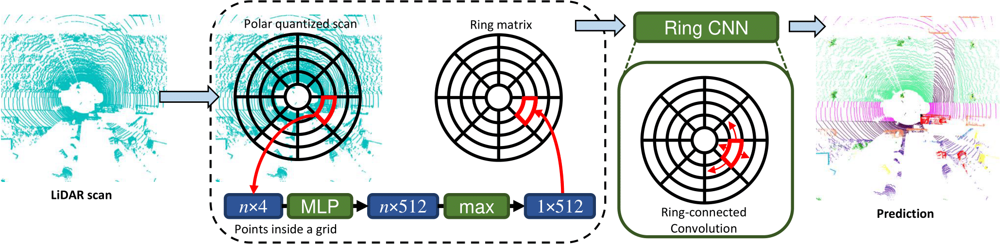
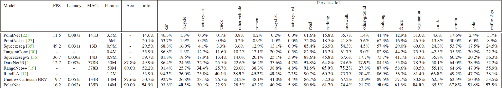

# PolarNet: An Improved Grid Representation for Online LiDAR Point Clouds Semantic Segmentation


<p align="center">
         
        <em>LiDAR scan visualization of SemanticKITTI dataset(left) and the prediction result of PolarNet(right).</em>
</p>

Official PyTorch implementation for online LiDAR scan segmentation neural network **PolarNet** (CVPR 2020).

<pre>
PolarNet: An Improved Grid Representation for Online LiDAR Point Clouds Semantic Segmentation
Yang Zhang*; Zixiang Zhou*; Philip David; Xiangyu Yue; Zerong Xi; Boqing Gong; Hassan Foroosh
Conference on Computer Vision and Pattern Recognition, 2020
*Equal contribution
</pre>

[[**ArXiv paper**]](https://arxiv.org/abs/2003.14032)

## What is PolarNet?

PolarNet is a lightweight neural network that aims to provide near-real-time online semantic segmentation for a single LiDAR scan. Unlike existing methods that require KNN to build a graph and/or 3D/graph convolution, we achieve fast inference speed by avoiding both of them. As shown below, we quantize points into grids using their polar coordinations. We then learn a fixed-length representation for each grid and feed them to a 2D neural network to produce point segmentation results.

<p align="center">
         
</p>

We achieved leading mIoU performance in the following LiDAR scan datasets : SemanticKITTI, A2D2 and Paris-Lille-3D.

<center>
	
Model | SemanticKITTI | A2D2 | Paris-Lille-3D
--- | --- | --- | ---
Squeezesegv2  | 39.7%  | 16.4% | 36.9%
DarkNet53 | 49.9%  |  17.2%  |  40.0%
RangeNet++ | 52.2%  | - | - | 
RandLA | 53.2%  | - | - | 
**PolarNet**  | **54.3%** | **23.9%** | **43.7%**

</center>

## Prepare dataset and environment

This code is tested on Ubuntu 16.04 with Python 3.5, CUDA 9.2 and Pytorch 1.3.1.

1, Install the following dependencies by either `pip install -r requirements.txt` or manual installation.
* numpy
* pytorch
* tqdm
* yaml
* Cython
* [numba](https://github.com/numba/numba)
* [torch-scatter](https://github.com/rusty1s/pytorch_scatter)

2, Download Velodyne point clouds and label data in SemanticKITTI dataset [here](http://www.semantic-kitti.org/dataset.html#overview).

3, Extract everything into the same folder. The folder structure inside the zip files of label data matches the folder structure of the LiDAR point cloud data.

4, Data file structure should look like this:

```
./
├── train.py
├── ...
└── data/
    ├──sequences
        ├── 00/           
        │   ├── velodyne/	# Unzip from KITTI Odometry Benchmark Velodyne point clouds.
        |   |	├── 000000.bin
        |   |	├── 000001.bin
        |   |	└── ...
        │   └── labels/ 	# Unzip from SemanticKITTI label data.
        |       ├── 000000.label
        |       ├── 000001.label
        |       └── ...
        ├── ...
        └── 21/
	    └── ...
```
## Training

Run
```shell
python train.py
```
to train a SemanticKITTI segmentation PolarNet from scratch after dataset preparation. The code will automatically train, validate and early stop training process.

Note that we trained our model on a single TITAN Xp which has 12 GB GPU memory. Training model on GPU with less memory would likely cause GPU out-of-memory. You will see the exception report if there is a OOM. In this case, you might want to train model with smaller quantization grid/ feature map via `python train.py --grid_size [320,240,32]`.

## Evaluate our pretrained model

We also provide a pretrained SemanticKITTI PolarNet weight.
```shell
python test_pretrain.py
```
Result will be stored in `./out` folder. Test performance can be evaluated by uploading label results onto the SemanticKITTI competition website [here](https://competitions.codalab.org/competitions/20331).

Remember to shift label number back to the original dataset format before submitting! Instruction can be found in [semantic-kitti-api repo](https://github.com/PRBonn/semantic-kitti-api). You should be able to reproduce the SemanticKITTI results reported in our paper.

<p align="center">
         
</p>

## Citation
Please cite our paper if this code benefits your research:
```
@InProceedings{Zhang_2020_PolarNet,
author = {Yang Zhang and Zixiang Zhou and Philip David and Xiangyu Yue and Zerong Xi and Boqing Gong and Hassan Foroosh},
title = {PolarNet: An Improved Grid Representation for Online LiDAR Point Clouds Semantic Segmentation},
booktitle={IEEE Conference on Computer Vision and Pattern Recognition},
Year = {2020},
}
```

